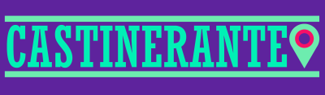

# Castinerante-blog

> Projeto simples, utilizando nextJS para visualizar os episodios do meu podcast [Castinerante](https://castinerante.com/)

  

## License/Licença do Projeto
[MIT License](./LICENSE.md) © [Renan Teixeira](https://github.com/renant)
